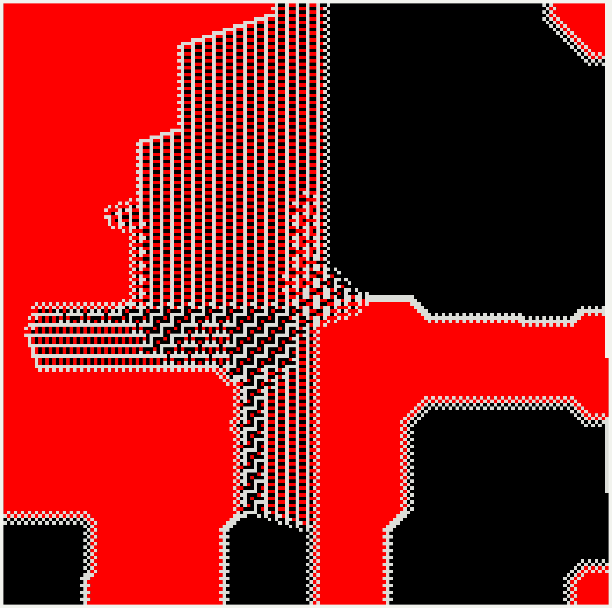

# Chromosaic

Chromosaic is a Rust explorer for spiral chess-piece colorings inspired by the Numberphile YouTube videos: [Red & Black Knights](https://www.youtube.com/watch?v=UiX4CFliegM) and the [Amazing Chessboard Patterns](https://www.youtube.com/watch?v=VgmDuBCayPw)

It places numbered cells on a square spiral, then lets multiple "players" take turns claiming the earliest legal cell for their color. A player's piece defines which offsets that color attacks, so changing the piece, color, or player order produces dramatically different colorings.

## Mathematical Context

The default two-knight experiment is connected to sequences in the [On-Line Encyclopedia of Integer Sequences](https://oeis.org/):

- [OEIS A392177](https://oeis.org/A392177): cells claimed by the first knight
  color in the two-color knight process.
- [OEIS A392178](https://oeis.org/A392178): cells claimed by the second knight
  color in the same process.



Chromosaic generalizes that idea by allowing different piece types and number, custom colors, and arbitrary ordering.

## What It Does

- Lets the user choose pieces, colors, and turn order.
- Supports many different leapers pieces, with ability to expand piece options.
- Shows an interactive native GUI preview with pan and zoom.
- Exports PNG images to `images/<piece_names>_<board_size>.png`.

## Gallery

### Zebra, Knight, King: 300,000 Cells


### Zebra, Camel, Giraffe: 300,000 Cells


Check out the `images` folder to see some other cool patterns or use this to generate your own patterns.


## How The Coloring Works

1. Build a square spiral beginning at `(0, 0)`.
2. Visit players in order, repeating from the first player after the last.
3. On each turn, the current player claims the earliest unoccupied spiral cell that is not attacked by any other player's already-claimed cells.
4. Once claimed, the cell attacks other cells using that player's piece offsets.
5. The process stops when the next player cannot claim any remaining legal cell.

The result is a deterministic coloring for a given board size, piece list, color list, and player order. This produces some extremely unexpected results and fantastic visuals.

## Running

Install a current Rust toolchain, then run:

```bash
cargo run --release
```

The GUI opens with the default 2 knights configuration. The left panel can be used to change board size, colors, piece types, and player order. The preview area should automatically update to the new configuration and can be used to inspect the result with zoom and pan controls.

## Exporting Images

Click **Export PNG** in the GUI in the bottom bar. The app writes the current coloring to the `images/` directory using the name of the pieces in order and board size, for example:

```text
images/zebra_knight_king_1000000.png
```

Exports are generated from the board data, not from the screen pixels, so zoom and pan do not affect the saved PNG.

## Piece File

Pieces are defined in `piecelist.txt`. Comments begin with `#`, and everything after `#` is ignored for that line. Each non-empty line defines one piece type using the format:

```text
<piece name>: <dx1>,<dy1>;<dx2>,<dy2>; ...
```

Each `dx,dy` pair is a base move offset. Chromosaic automatically expands each base move into all rotations and reflections, so a only a single base move is required to define the classic Chess Knight:

```text
King: 1,0;1,1 # Classic Chess King
Knight: 1,2 # Classic Chess Knight
Zebra: 3,2 # A 3-2 Jumper Piece
```

To add a piece, append a new line to `piecelist.txt` using the same format, then restart the application to load the new piece list.

## AI USAGE
GUI, visualization, and PNG export code was primarly written by AI with personal review.
